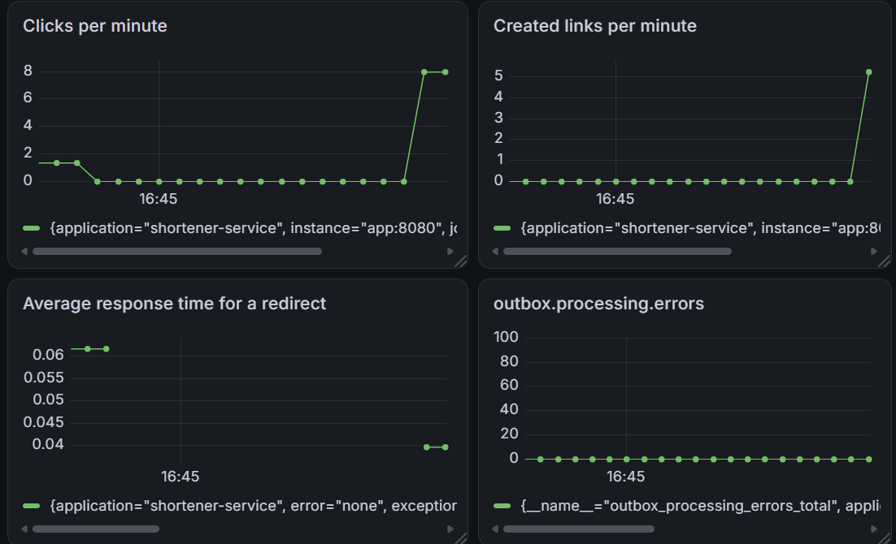

# URL Shortener

A microservices-based URL shortening service built as a learning project in a backend development program.

**Live demo:** http://217.60.1.84/app

## Tech Stack

- Java 21, Spring Boot 4
- PostgreSQL, Liquibase
- Redis (caching, rate limiting)
- Apache Kafka (async analytics, DLQ)
- Docker, Docker Compose
- Prometheus, Grafana
- Kubernetes (minikube)
- Nginx, VPS deployment

## Architecture

Two services:

- `shortener-service` — creates links, handles redirects, publishes events to Kafka
- `analytics-service` — consumes Kafka events, tracks click statistics

```
Browser → Nginx → shortener-service → PostgreSQL
                       ↓
                     Kafka → analytics-service → analytics-db
                       ↓
                  Redis (cache + rate limit)
```

## Getting Started

```bash
git clone https://github.com/Luri1337/shortener-service.git
cd shortener-service
cp .env.example .env   # fill in your secrets
docker compose up --build
```

- Frontend: http://localhost/app
- Swagger: http://localhost:8080/swagger-ui/index.html
- Grafana: http://localhost:3000 (admin/admin)
- Prometheus: http://localhost:9090

## API

| Method | Endpoint | Description |
|---|---|---|
| POST | /api/links | Create a short link |
| GET | /r/{shortCode} | Redirect to original URL (302) |
| GET | /api/links/{shortCode} | Get link info |
| DELETE | /api/links/{shortCode} | Delete a link |
| GET | /api/links/{shortCode}/analytics | Detailed analytics |

## Features

- ✅ URL validation with meaningful error messages
- ✅ Link expiration support (410 Gone)
- ✅ Redis cache for fast redirects
- ✅ Rate limiting (10 requests per minute per IP)
- ✅ Kafka + Dead Letter Queue for reliable analytics
- ✅ Structured logging with correlationId across services
- ✅ Grafana dashboard with custom metrics
- ✅ Transactional Outbox Pattern for guaranteed event delivery
- ✅ Kubernetes manifests (minikube)
- ✅ Deployed on VPS behind Nginx reverse proxy

## Monitoring



Metrics tracked:
- Clicks per minute
- Links created per minute
- Average redirect response time
- Outbox processing errors
